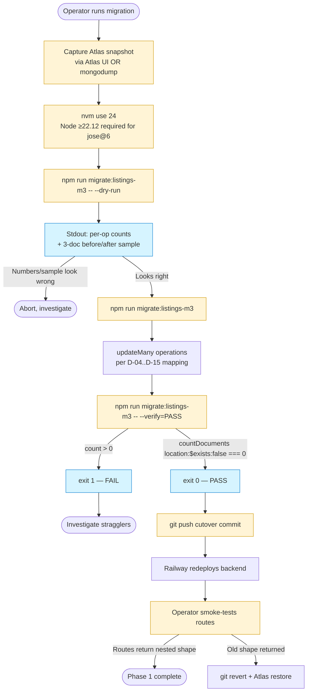

# Phase 1: Schema Reshape + Backend Route Shape Cutover — Research

**Researched:** 2026-05-05
**Domain:** Mongoose schema reshape (flat → nested) + operator-supervised one-shot migration + atomic backend route cutover
**Confidence:** HIGH (decisions locked in CONTEXT.md; migration pattern verbatim from M2 precedent; Mongoose API verified via Context7; Atlas tier caveat surfaced via web search)

---

## User Constraints (from CONTEXT.md)

### Locked Decisions

**Cutover atomicity & deploy sequence**

- **D-01 (Atomic-break cutover — no compat window):** Backend routes cut to nested-only shape at the cutover commit. M2 client (TestFlight build 27 + Play Internal versionCode 30) reads flat shape and WILL break against the new backend until Phase 2 ships. Accepted because (a) testers are dev-team-only on Internal Testing tracks, (b) M1+M2 listings are mock data, (c) matches M1+M2 atomic-cutover precedent. Backend transformer (dual-shape window) and Phase 1 client defensive-reads are REJECTED. Phase 1's `Property.ts` type-stub update is a compile-time enabler for Phase 2; nothing in `src/screens/` or `src/components/` is touched in Phase 1.

- **D-02 (Operational deploy sequence — M2 Plan 02-02 verbatim):** Atlas snapshot → `nvm use 24` → dry-run → live → `--verify=PASS` → `git push` cutover → smoke test. Operator-supervised throughout.

- **D-03 (Migration idempotency — skip-already-migrated filters):** Top-level "needs migration" filter is `{location: {$exists: false}}`. Re-running on a partially-migrated dataset modifies 0 already-nested rows. No `_m3migrated:true` marker, no pure-`$set` overwrite.

**Schema field mapping policy (legacy flat → nested)**

- **D-04 (Deal type backfill):** Legacy `type:'rent'` → `dealType:'rent_long'`. Legacy `type:'sale'` → `dealType:'sale'`. No conditional by `propertyType`.

- **D-05 (Address policy):** DROP legacy free-form `address` string. The `required: true` constraint is also removed (replaced by `location.coordinates` required-via-Mongoose).

- **D-06 (District backfill):** `location.district = ''` for every migrated legacy row.

- **D-07 (Rooms numeric→string conversion):** `rooms === 1` → `'1'`; `rooms === 2` → `'2'`; `rooms === 3` → `'3'`; `rooms >= 4` → `'4+'`; `rooms === 0 || rooms == null` → omit. Destination differs by propertyType: `apartment|house|office|commercial` → `basics.rooms`; `hotel|hostel` → `basics.hotelRooms`.

- **D-08 (Drop legacy `bedrooms` and `bathrooms`):** Both fields dropped in migration. SPEC's `basics.bathroom` is enum `'private' | 'none' | 'shared'` (availability, not count); bathroom counts have no SPEC home.

- **D-09 (M1 Hospitality `maxGuests` and `amenities[]`):** Preserved at top level. M1 Phase 6 read paths (`HospitalityCard`, `PropertyDetailsScreen`, `HospitalitySection`) consume these; SPEC §3 is silent on amenities for hotel/hostel.

- **D-10 (Orphan top-level fields — selective preservation):**
  - **KEEP top-level:** `instagramUrl`, `availableDate`, `listingId`, `platformVerifications.{ownershipDocuments, ownerIdentityVerified, stateIssuedDocumentsVerified}`, `verificationUpdatedAt`, `verificationUpdatedByUid`.
  - **DROP in migration:** `period`, `is3DTourAvailable` (derive from `media.tourUrl` at read time), `agent.{name, rating, reviews, imageUrl}`.
  - All M2 audit fields stay top-level per SCHEMA-04 hard rule.

- **D-11 (`content.language` backfill):** `'ru'` default for all legacy rows.

**Media coalescing strategy**

- **D-12 (`tours[]` → `media.tourUrl`):** First non-empty `tours[i].url`. Tour metadata (`id`, `title`, `thumbnailUrl`) dropped.

- **D-13 (`panoramicPhotosUrl`):** DROP in migration. Phase 3 mod-curation owns media re-attachment.

- **D-14 (`videoUrl: String` → `media.videos: [videoUrl]`):** `media.videos = videoUrl ? [videoUrl] : []`.

- **D-15 (`images: [String]` → `media.photos`):** `media.photos = images || []`. Drop derived `imageUrl`.

**Rollback strategy**

- **D-16 (Atlas snapshot is the rollback mechanism — no reverse migration script):** Operator captures Atlas snapshot timestamp BEFORE running migration. Rollback procedure = (a) `git revert <route-cutover-commit-SHA>` to restore flat-shape route reads, (b) restore MongoDB from the captured Atlas snapshot via the Atlas UI to restore flat-shape data.

- **D-17 (Rollback runbook — inline in `01-CONTEXT.md §Rollback`):** NOT a standalone `01-RUNBOOK.md` file.

- **D-18 (Pre-migration verification — `--dry-run` prints counts + 3-doc sample preview):** Migration script also prints pre-condition assertion.

### Claude's Discretion

1. **Phase 1 backend test update scope** — researcher/planner decides during plan-phase. Default: tests cut over with code (atomic-cutover principle).
2. **Mongoose schema strict mode policy** — `strict: true` (default) vs `'throw'` vs `false`.
3. **`Property.ts` type stub shape on the RN client** — full nested type vs `LegacyFlat | NestedShape` union.
4. **Migration sample-preview doc selection** — random vs propertyType-biased.
5. **Schema versioning marker** — optional `schemaVersion: 'm3-nested-v1'` field.
6. **Mongoose virtual `specs`** — delete vs rewrite.
7. **`tour.thumbnailUrl` data fate** — drop unless meaningful population is found.
8. **S3 URL format checks during migration** — cheap pre-flight check; researcher discretion.

### Deferred Ideas (OUT OF SCOPE)

- Backend transformer / dual-shape window during Phase 1→2 gap
- Phase 1 defensive client patches (interim v2.0.1)
- Per-doc `_legacyFlat:{...}` snapshot field for local reverse migration
- `migrate-listings-m3.js --reverse` script
- Heuristic Cyrillic-vs-Latin language detection for `content.language` backfill
- Pre-migration migration via Railway deploy hook
- Conditional `dealType` mapping by `propertyType`
- `location.exactAddress: string` extra-to-SPEC field
- `maxGuests` and `amenities[]` move under `basics.hospitality:{...}`
- Drop `instagramUrl` / `availableDate` / `listingId` / `platformVerifications`
- `is3DTourAvailable` preserved at top level
- `panoramicPhotosUrl` coalesced into `media.tourUrl`
- Multi-tour preservation in `media.tourUrl[]`
- Standalone `01-RUNBOOK.md` file
- Top-level `scripts/migrate-listings-m3.md` operator doc in backend repo
- Sample-preview disabled for `--dry-run`
- Phase 4.5 landlord-application uid-mismatch fix (Phase 4 scope)
- ROLE-11 frontend mid-action 403 popup-recovery (Phase 4 scope)
- Mod media-curation view + `POST /api/moderation/listings/:id/media` (Phase 3 scope)
- AWS S3 IAM policy update (Phase 3 scope)
- 6-step `<ContextualListingFlow>` (Phase 2 scope)
- v3.0.0 atomic version bump + dual-store submission (Phase 5 scope)
- EN+RU placeholder copy for `location.district === ''` (Phase 2 scope)
- Race-cell test rig (M4+)
- Android `gradlew clean bundleRelease` reanimated build doc (M4+)
- AWS IAM cross-project residual (M4+)

---

## Phase Requirements

| ID | Description | Research Support |
|----|-------------|------------------|
| SCHEMA-01 | Reshape Property Mongoose schema to nested top-level objects (`location`, `basics`, `conditionAndAmenities`, `content`, `terms`, `media`); preserve M2 status enum + audit fields top-level | §"Standard Stack" Mongoose nested-schema patterns; §"Code Examples" 1-3 (verbatim Mongoose nested-object syntax verified via Context7); §"Architecture Patterns" §1 mirror of `platformVerifications` in current Property.js |
| SCHEMA-02 | Add `migrate-listings-m3.js` operator-supervised one-shot migration with `--dry-run` and `--verify=PASS` flags; idempotent skip-already-migrated filter; acceptance is `db.properties.countDocuments({location: {$exists: false}}) === 0` | §"Architecture Patterns" §2 (M2 migration template); §"Code Examples" 4-5 (verify=PASS exact-match logic + idempotent filter); §"Common Pitfalls" §1-3 (filter edge cases, `nvm use 24`, sample preview) |
| SCHEMA-03 | Status enum unchanged (`pending | live | rejected | archived`); migration script does NOT touch status field | §"Architecture Patterns" §3 (audit-field "additive only" discipline); §"Code Examples" 1 (status enum literal preserved verbatim) |
| SCHEMA-04 | All M2 + M2-Phase-4 audit fields stay top-level — never nested under `terms.*` | §"Code Examples" 1 (top-level audit field block); §"Architecture Patterns" §3; §"Common Pitfalls" §4 (terms-nesting trap) |
| SCHEMA-05 | Backend read/write routes cut over to nested shape; cutover commit STRICTLY AFTER migration succeeds; rollback documented against Atlas snapshot | §"Architecture Patterns" §4 (atomic cutover sequencing); §"Standard Stack" Atlas backup tier table; §"Common Pitfalls" §5-7 (Atlas free-tier no snapshot, Railway redeploy timing, post-cutover smoke test) |

---

## Project Constraints (from CLAUDE.md)

The following directives from `/Users/beckmaldinVL/development/mobileApps/JayTap/CLAUDE.md` are load-bearing for Phase 1:

- **Backend repo location:** `/Users/beckmaldinVL/development/mobileApps/backend-services/JayTap-services` (separate from RN client repo). All Phase 1 schema/route changes happen in the backend repo. RN client touches `src/types/Property.ts` only.
- **Backend Node version:** `engines.node >= 22.12.0` (jose@6 ESM-only). Default shell node is v20.19.1; backend agents MUST `nvm use 24` before any `npm`/`node` invocation. Migration runbook is gated on this.
- **No Firebase SDK in either repo** — migration script must NOT introduce `firebase` / `@react-native-firebase/*`. Backend continues using `jose` for JWKS verification.
- **MongoDB role authority** — Firebase = identity proof; MongoDB `userType` = role authority. Phase 1 doesn't touch the User schema; rule preserved by inaction.
- **No `react-navigation` migration** — Phase 1 ships zero RN client navigation changes.
- **EN+RU bilingual parity** — Phase 1 has minimal i18n surface; D-06 placeholder copy is deferred to Phase 2 client.
- **Manual physical-device QA bar** — Phase 1 has zero RN client surface, so manual-device QA is not part of this phase. Phase 5 owns the cross-cutting QA matrix.
- **Geographic scope KG/KZ/UZ** — D-11 'ru' default for `content.language` aligns with Bishkek launch market.

---

## Summary

Phase 1 is a **brownfield Mongoose schema reshape + operator-supervised one-shot data migration + atomic route cutover** in the JayTap-services backend. The schema reshape is mostly mechanical (move flat top-level fields under nested objects per the SPEC §"Suggested Data Shape"), but the migration script is the load-bearing artifact: a sibling of the M2 `migrate-listings-m2.js` template with three new wrinkles — (a) a richer per-doc transform with multi-step field mapping (D-04..D-15), (b) a proper `--verify=PASS` flag matching the REQUIREMENTS.md SCHEMA-02 acceptance verbatim (`db.properties.countDocuments({location: {$exists: false}}) === 0`), (c) a 3-doc sample preview emitted by `--dry-run` for visual operator inspection.

The cutover is **atomic-break**: the in-flight M2 client (TestFlight build 27 + Play Internal versionCode 30) WILL break against the new backend until Phase 2 ships nested-aware reads. This is locked via D-01 — no transformer, no defensive-reads, no dual-shape window. Operator-supervised deploy sequence (Atlas snapshot → dry-run → live → verify=PASS → cutover commit → smoke test) inherits verbatim from M2 Plan 02-02. Atlas snapshot is the rollback mechanism (D-16) — no reverse migration script.

**Primary recommendation:** Plan five sequential plans matching the M2 Plan 02-02 cadence: (1) Schema reshape + tests, (2) Migration script + tests, (3) `propertyRoutes.js` cutover + tests, (4) `moderationRoutes.js` cutover + tests, (5) RN client `Property.ts` type-stub + Atlas snapshot/runbook documentation. Wire `--verify=PASS` exit-code semantics carefully; sample-preview should be propertyType-biased to exercise D-07's conditional sub-field branches; `schemaVersion: 'm3-nested-v1'` marker is recommended for cheap forward-compat traceability; Mongoose virtual `specs` should be DELETED (its only consumers — RN client screens — already break per D-01); type-stub strategy: ship a full nested type (the simpler approach — Phase 2 owns the canonical type).

---

## Architectural Responsibility Map

| Capability | Primary Tier | Secondary Tier | Rationale |
|------------|-------------|----------------|-----------|
| Property data shape (Mongo doc) | Database / Storage | — | Mongoose schema is the canonical shape. Migration script is the single tool that mutates stored data. |
| Property route request/response shape | API / Backend | — | propertyRoutes + moderationRoutes are the only callers of Property model methods. Cut over in lockstep with schema. |
| Operator-supervised migration | Database / Storage | API / Backend (Mongoose model load) | Migration is a one-shot Node script invoked by operator; uses backend's Mongoose model + connectDB helper. |
| Rollback (Atlas snapshot restore + git revert) | Database / Storage | API / Backend (route revert) | DB snapshot restore handles data; git revert handles route shape. Both are operator-side actions. |
| RN client compile-time type knowledge | Frontend Server (TypeScript) | — | `Property.ts` type stub enables Phase 2 PR drafts to compile; not consumed at runtime in Phase 1 (M2 client breaks per D-01). |
| Smoke-test verification post-cutover | API / Backend (read endpoints) | Operator (curl/HTTP commands) | Operator hits routes with curl after Railway redeploys; verifies nested shape returned. |

**Why this matters:** Phase 1 is correctly scoped to two tiers — Database/Storage (schema + data + rollback) and API/Backend (routes + tests). RN client tier is touched only by a compile-time type stub (Phase 2 owns the runtime cutover). No browser/CDN tier involvement. The map prevents the planner from accidentally mixing Phase 2 client work into Phase 1 plans.

---

## Standard Stack

### Core (already installed in JayTap-services)

| Library | Version | Purpose | Why Standard |
|---------|---------|---------|--------------|
| `mongoose` | `^9.1.6` (currently installed; latest is `9.6.1` per `npm view mongoose version`) | ODM for Mongo schema definition + migration script | Already the project's ODM since M1. Nested-object syntax is the standard pattern (used today for `platformVerifications` and `tours[]` in current Property.js). [VERIFIED: package.json line 25; npm registry] |
| `dotenv` | `^17.2.3` | Load `MONGO_URI` for migration script | Already used in `migrate-listings-m2.js` and `seed.js`. [VERIFIED: package.json line 22; existing scripts] |
| `mongodb-memory-server` | `^9.5.0` (devDependency) | In-memory Mongo for Jest integration tests | Already wired up in `src/__tests__/setup.js`. Phase 1 tests reuse this infrastructure. [VERIFIED: package.json line 33; setup.js verified] |
| `jest` | `^29.7.0` | Test runner | Existing infrastructure. [VERIFIED: package.json line 32] |
| `supertest` | `^7.1.4` | HTTP integration tests against Express routes | Existing pattern in `propertyRoutes.test.js` + `moderationRoutes.test.js`. [VERIFIED: package.json line 34] |

### Supporting (no new packages)

Phase 1 introduces **zero** new npm dependencies in either repo. The migration script reuses `mongoose` + `dotenv` + the existing `connectDB` helper. Tests reuse the existing `mongodb-memory-server` + `supertest` + `jose` (JWKS) infrastructure.

### Alternatives Considered

| Instead of | Could Use | Tradeoff |
|------------|-----------|----------|
| Mongoose nested objects (chosen — D-04..D-15) | Mongoose `Schema.Types.Mixed` | Mixed loses type safety + casting; nested objects give validation per nested field. Existing schema already uses nested shape for `platformVerifications` and `tours[]` — pattern fit. |
| Skip-already-migrated filter `{location: {$exists: false}}` (chosen — D-03) | Per-doc `_m3migrated: true` boolean marker | Marker creates dead field; the natural filter already discriminates correctly because `location` is the single unambiguous nested-shape sentinel. |
| Atlas UI snapshot (chosen — D-16) | `mongodump` to operator's machine | `mongodump` works on Atlas free tier (M0) where snapshot UI is unavailable. RECOMMENDED FALLBACK if Atlas tier doesn't support snapshots — see §"Common Pitfalls" §5. [VERIFIED: docs.mongodb.com/atlas/backup/cloud-backup/snapshot-management] |

**Installation:** None needed. Phase 1 plans skip a "Wave 0 install" step.

**Version verification:** `mongoose@9.1.6` is installed; `9.6.1` is current as of 2026-05-05 [VERIFIED: `npm view mongoose version`]. The schema-reshape API surface (Schema constructor, nested objects, validators, virtuals) is stable across the 9.x line — no upgrade required for Phase 1. Planner may opt to upgrade to `9.6.1` in a separate housekeeping commit but it's not load-bearing.

---

## Architecture Patterns

### System Architecture Diagram



This diagram traces the operator's workflow through Phase 1 cutover. Every step is a discrete operator command; each gate is a stdout signal that drives the next step. The `--verify=PASS` exit code is the canonical phase-acceptance signal.

### Recommended Project Structure (delta from current)

```
JayTap-services/
├── src/
│   ├── models/
│   │   └── Property.js              # RESHAPE — flat → nested per SPEC §"Suggested Data Shape"
│   ├── routes/
│   │   ├── propertyRoutes.js        # CUTOVER — every route's body shape + return shape
│   │   └── moderationRoutes.js      # CUTOVER — queue/approve/reject/edit-on-behalf
│   ├── scripts/
│   │   ├── migrate-listings-m2.js   # UNTOUCHED (M2 artifact)
│   │   ├── migrate-roles-m2.js      # UNTOUCHED
│   │   ├── migrate-landlord-capability.js # UNTOUCHED
│   │   ├── seed.js                  # UNTOUCHED (mock data — may or may not need a follow-up update)
│   │   └── migrate-listings-m3.js   # NEW — sibling of migrate-listings-m2.js (D-02 verbatim pattern)
│   └── __tests__/
│       ├── Property.test.js                # UPDATE — nested-shape default + enum + audit-fields
│       ├── propertyRoutes.test.js          # UPDATE — nested-shape POST/PUT/GET
│       ├── moderationRoutes.test.js        # UPDATE — nested-shape queue/approve/reject/edit-on-behalf
│       ├── adminRoutes.test.js             # AUDIT — likely no changes (touches User shape, not Property)
│       └── migrate-listings-m3.test.js     # NEW — idempotency + verify=PASS + per-D mapping cases
└── package.json                       # UPDATE — add `migrate:listings-m3` npm script
```

```
JayTap/
└── src/
    └── types/
        └── Property.ts               # UPDATE — replace flat-shape interface with nested-shape interface
                                      # (no changes to src/screens/* or src/components/* per D-01)
```

### Pattern 1: Mongoose Nested Schema Definition

**What:** The new Property schema uses nested objects under `location`, `basics`, `conditionAndAmenities`, `content`, `terms`, `media`. M2 audit fields and operational metadata stay at the top level adjacent to the nested objects.

**When to use:** Phase 1's primary schema reshape. This is the verbatim mechanism for D-04..D-15 mapping policy.

**Example:**

```javascript
// Source pattern: existing Property.js platformVerifications nested object (line 67-71)
// + Mongoose docs verified via Context7 (/automattic/mongoose, schema guide)
const PropertySchema = new mongoose.Schema({
  // Top-level operational/admin metadata (D-10 keep set)
  listingId:    { type: String, unique: true },
  ownerUid:     String,
  instagramUrl: String,
  availableDate: Date,
  propertyType: { type: String, default: 'apartment' },
  dealType:     { type: String, enum: ['sale', 'rent_long', 'rent_daily'] }, // D-04 backfill source

  // Nested location object (SPEC §"Suggested Data Shape" + §"Step 2 — Location")
  location: {
    city:     { type: String },
    district: { type: String, default: '' }, // D-06 backfill default
    coordinates: {
      lat: { type: Number },
      lng: { type: Number },
    },
    showExactAddress: { type: Boolean, default: false },
  },

  // Nested basics object (SPEC §"Step 3 — Basic Information")
  basics: {
    areaSqm:  { type: Number },
    price:    { type: Number },          // tightened from Mixed per SPEC §3 (recommend; planner may keep Mixed for backward compat)
    currency: { type: String, enum: ['KGS', 'USD', 'EUR'] },
    rooms:      { type: String, enum: ['1', '2', '3', '4+'] },
    bathroom:   { type: String, enum: ['private', 'none', 'shared'] },
    kitchen:    { type: String, enum: ['private', 'none', 'shared'] },
    hotelRooms: { type: String, enum: ['1', '2', '3', '4+'] },
    hotelClass: { type: String, enum: ['economy', 'standard', 'comfort', 'premium'] },
  },

  conditionAndAmenities: {
    condition: { type: String, enum: ['rough', 'whitebox', 'good', 'euro'] },
    furnished: { type: Boolean },
  },

  content: {
    title:       { type: String },       // required moves to API layer (was top-level required: true)
    description: { type: String },
    language:    { type: String, enum: ['ru', 'en'], default: 'ru' }, // D-11
  },

  terms: {
    negotiable: { type: Boolean },
    deposit: {
      amount:   { type: Number },
      currency: { type: String, enum: ['KGS', 'USD', 'EUR'] },
    },
    prepaymentMonths: { type: Number },
    minTerm:          { type: String, enum: ['1_day', '1_month', '3_months'] },
  },

  media: {
    photos:  { type: [String], default: [] },     // D-15 source: legacy `images: [String]`
    videos:  { type: [String], default: [] },     // D-14 source: legacy `videoUrl: String` wrapped
    tourUrl: { type: String },                    // D-12 source: tours.find(t=>t.url).url
  },

  // M1 Hospitality preserve top-level (D-09)
  maxGuests: { type: Number },
  amenities: { type: [String], default: [] },

  // M2 status enum — verbatim preserved (SCHEMA-03)
  status: {
    type: String,
    enum: ['pending', 'live', 'rejected', 'archived'],
    default: 'pending',
  },

  // M2 + M2-Phase-4 audit fields — verbatim preserved at TOP LEVEL (SCHEMA-04 hard rule)
  submittedAt:         { type: Date },
  approvedAt:          { type: Date, default: null },
  approvedByUid:       { type: String, default: null },
  rejectedAt:          { type: Date, default: null },
  rejectedByUid:       { type: String, default: null },
  rejectionReasonCode: { type: String, default: null },
  rejectionReasonNote: { type: String, default: null },
  archivedAt:          { type: Date, default: null },
  archivedByUid:       { type: String, default: null },
  archivedReasonCode:  { type: String, default: null },
  archivedReasonNote:  { type: String, default: null },

  // Platform verifications — verbatim preserved (D-10 keep set)
  platformVerifications: {
    ownershipDocuments:           { type: Boolean, default: false },
    ownerIdentityVerified:        { type: Boolean, default: false },
    stateIssuedDocumentsVerified: { type: Boolean, default: false },
  },
  verificationUpdatedAt:    { type: Date },
  verificationUpdatedByUid: { type: String },

  // Optional M3 schema-version marker (Claude's Discretion #5 — RECOMMENDED)
  schemaVersion: { type: String, default: 'm3-nested-v1' },
}, {
  timestamps: true,
  collection: 'listings',
  toJSON:   { virtuals: true },
  toObject: { virtuals: true },
});

module.exports = mongoose.model('Property', PropertySchema);
```

**Notes on this example:**
- The `specs` virtual is OMITTED here — recommendation is to DELETE it (see Claude's Discretion §6 below). RN client consumers (`PropertyDetailsScreen`, `PropertyCard`, `CreateListingScreen`) already break per D-01 atomic-break.
- Strict mode is `true` by default (no explicit `strict: true` line needed). [VERIFIED: Mongoose docs, /automattic/mongoose schema guide]
- `address: {required: true}` is REMOVED per D-05; `title: {required: true}` is also relaxed (validation moves to the route layer in Phase 2; Phase 1 keeps Mongoose permissive so the migration doesn't reject docs that lacked these fields).

### Pattern 2: One-Shot Migration Script (Sibling to M2 Pattern)

**What:** A Node script under `src/scripts/migrate-listings-m3.js` that parses CLI flags (`--dry-run`, `--verify=PASS`), connects via the existing `connectDB` helper, and runs idempotent `updateMany` operations.

**When to use:** SCHEMA-02. Triggered by operator from CLI; never auto-invoked by Railway deploy hook (D-02 explicit).

**Example:** See §"Code Examples" §2 below for the verbatim template.

### Pattern 3: Audit-Field "Additive Only" Schema Discipline

**What:** Audit fields stay at top level of every Property doc. The migration script DOES NOT TOUCH `status` or any audit field (SCHEMA-03 + SCHEMA-04 verbatim).

**When to use:** Every nested-shape decision — must check that the destination is the new nested object AND that no audit field is being migrated.

**Source pattern:** M2 Phase 1 D-04 + Phase 2 D-21 + Phase 4 archive lifecycle additive extensions. Same discipline carries forward: Phase 1 schema is the M2 schema PLUS the new nested objects, never RESHAPING audit fields under nested paths.

### Pattern 4: Atomic Cutover Commit (M2 Plan 02-02 Verbatim)

**What:** Migration runs FIRST. Cutover commit (the SHA that flips routes from flat to nested) lands AFTER `--verify=PASS` returns exit 0. ROADMAP SC #4 verbatim.

**When to use:** SCHEMA-05. The cutover commit is the FIRST commit after the migration runs successfully.

**Why:** If the cutover commit lands BEFORE migration, every legacy doc (still flat) returns broken on read paths (no `location` object). Same precedent as M1 D-02 atomic version-bump.

### Anti-Patterns to Avoid

- **Pure-`$set` overwrite migration (no idempotency)** — re-running on an already-migrated dataset writes the same fields N times. Wasteful + risks accidentally clobbering downstream writes that landed between dry-run and live. Use D-03's filter pattern instead.

- **Mongoose virtual rewriting** — rewriting `Property.virtual('specs').get` to read from `basics.{rooms, areaSqm}` looks defensive but creates a hidden coupling: M2 client expects `specs.beds` (numeric, from old `bedrooms`) but new schema has `basics.rooms` (string enum '1'..'4+'). Type mismatch at the consumer. DELETE the virtual entirely (§Code Examples §1 omits it).

- **Auto-deploy migration via Railway hook** — D-02 explicitly forbids it. Operator-supervised one-shot is the M2 precedent for the same reason: dry-run review is the safety gate; auto-deploy bypasses it.

- **Body-status sanitizer regression** — propertyRoutes PUT line 414-418 strips `status` from body for non-mod/admin. The cutover MUST preserve this sanitizer verbatim — the rejected→pending auto-flip at line 422-431 is the only legal owner status transition. Any cutover that touches the sanitizer or auto-flip logic is out-of-scope for Phase 1.

- **Removing top-level `address` from incoming POST body without server-side fallback** — D-05 drops the legacy free-form `address` field. But the M2 client (which still POSTs flat shape) passes `address` in the body. Per D-01 atomic break, the server REJECTS the M2 client POST (the new POST validator only accepts nested-shape body). This is intentional, but the planner must verify the route layer's 400 error handling is clear (don't return a generic "validation failed" when the server-side reject is structural).

---

## Don't Hand-Roll

| Problem | Don't Build | Use Instead | Why |
|---------|-------------|-------------|-----|
| Mongo schema definition | Hand-rolled JSON schema validator | Mongoose nested-object schemas | Mongoose handles default values, enum validation, type casting, JSON serialization. Already the project's standard. |
| Migration CLI flag parsing | `commander` or `yargs` package install | `process.argv.slice(2).includes(flag)` (M2 precedent) | M2's `migrate-listings-m2.js` uses `args.includes('--dry-run')` and `args.includes('--verify')`. Phase 1 needs to additionally parse `--verify=PASS` (the `=PASS` suffix). Implement as `args.find(a => a.startsWith('--verify')) === '--verify=PASS'`. No new dep needed. |
| Mongo connection lifecycle | New `MongoClient.connect(...)` block | Existing `connectDB` helper (`src/config/db.js`) | Already battle-tested through M1 + M2 migration scripts. Includes the `bizdinkonush` database-name normalization quirk. |
| Idempotency marker | `_m3migrated: true` per-doc field | `{location: {$exists: false}}` filter (D-03) | The natural filter already discriminates correctly because `location` is the unambiguous nested-shape sentinel. Marker creates dead field. |
| Rollback / reverse migration | Reverse-mapping script reading nested → flat | Atlas snapshot restore + `git revert` (D-16) | Reverse mapping is lossy: `'4+' rooms` cannot reconstruct a number; dropped fields like `address` and `panoramicPhotosUrl` cannot be restored. Atlas snapshot is the lossless undo. |
| Sample-doc randomization | New random-sample lib | `Property.find().limit(N).sort({_id: ...})` or `Property.aggregate([{$sample: {size: 3}}])` | Mongoose's built-in aggregation `$sample` operator is the standard idiom. [VERIFIED: MongoDB docs] |

**Key insight:** Phase 1 is the kind of phase that tempts custom abstractions ("a generic schema-migration framework!") — resist. The M2 migration scripts are 99 LOC each and ship verbatim patterns that work. The migration is a one-shot; lifetime of the script is < 1 minute of operator time on the day of cutover.

---

## Runtime State Inventory

> Phase 1 is a schema-reshape + data-migration phase, not a rename. But the **critical inventory question** for migrations is: *After every doc in the listings collection is migrated, what runtime systems still expect the old flat shape?*

| Category | Items Found | Action Required |
|----------|-------------|------------------|
| Stored data | **MongoDB Atlas `listings` collection** — every existing doc currently in flat shape (count is M1+M2 mock data per `PROJECT.md §Out of Scope`; operator runs `db.properties.countDocuments({})` during dry-run to confirm exact count). All docs need `D-04..D-15` mapping applied. | Data migration via `migrate-listings-m3.js` — Phase 1 SCHEMA-02. |
| Stored data | **MongoDB Atlas `moderationLog` collection** — audit rows reference `targetId` (Property._id, unchanged) and `before`/`after` snapshots (which embed flat-shape Property fields). | **NO MIGRATION NEEDED.** Audit rows are forward-fit observability per M2 PATTERNS §G. Old rows correctly snapshot the old shape; new rows will snapshot the new shape. The mismatch is a feature, not a bug — it captures the cutover moment. |
| Live service config | **Railway backend service env** — `MONGO_URI`, `AWS_*`, `FIREBASE_PROJECT_ID` unchanged. No env var renames in Phase 1. | None — verified by inspection of `propertyRoutes.js` and `migrate-listings-m2.js` env usage. |
| Live service config | **MongoDB Atlas snapshot config** — depends on Atlas tier (M0 free vs M10+ paid). See §"Common Pitfalls" §5 for the tier-dependent rollback procedure. | Operator confirms Atlas tier before running migration; if M0 free tier, falls back to `mongodump` (see §Code Examples §6). |
| OS-registered state | **None.** No Windows Task Scheduler / launchd / systemd / pm2 registrations specific to this migration. The migration is a one-shot manual `npm run` — no daemonization. | None — verified explicitly. |
| Secrets and env vars | **None renamed.** D-04..D-15 are field-shape changes inside Mongo docs; no secret keys or env var names change. | None — verified explicitly. |
| Build artifacts / installed packages | **None.** Phase 1 introduces zero new npm dependencies; no compiled binaries; no Docker image tags. The cutover commit is a normal `git push` — Railway pulls + redeploys. | None — verified explicitly. |
| **In-flight RN client (TestFlight/Play Internal)** | **iOS TestFlight build 27** + **Android Play Internal versionCode 30** (per memory `m2-shipped-2026-05-05.md`). These clients send/expect FLAT shape. After cutover, they will fail to render Home/Favorites/RenterListings/OwnerListings/PropertyDetails screens. | **Per D-01 atomic-break — NO action in Phase 1.** Phase 2 ships the nested-aware client. Tester comms required (planner adds this to runbook): maintainer Slacks/emails dev-team testers BEFORE cutover saying "expect Home to break for ~N days; install Phase 2 build when notified." |

**The canonical question:** *After every doc is migrated to nested shape, what runtime systems still have the flat shape cached, stored, or registered?*

Answer: only the in-flight M2 client builds (already accepted-broken per D-01). Backend code itself flips to nested-shape reads at the cutover commit, so backend-side caches don't apply.

---

## Common Pitfalls

### Pitfall 1: Idempotency filter edge cases (`location: null` vs `location: {}` vs `location: undefined`)

**What goes wrong:** The D-03 filter `{location: {$exists: false}}` matches docs where `location` is undefined. But what if a partial migration leaves docs with `location: null` or `location: {}` (empty object)?

**Why it happens:** A migration crash mid-run could leave a doc with `location: {}` if the script's `$set` had partial coverage. Or a developer manually testing in Mongo shell could insert a doc with `location: null`.

**How to avoid:**
- Tighten the filter to `{ $or: [{ location: { $exists: false } }, { location: null }, { location: {} } ] }` — covers all three "needs migration" sentinels.
- The acceptance verbatim in REQUIREMENTS.md SCHEMA-02 is `db.properties.countDocuments({location: {$exists: false}}) === 0`. If the planner uses the broader filter, the `--verify=PASS` assertion should still use the verbatim `{$exists: false}` form (REQUIREMENTS.md is binding).
- Add a Wave 0 unit test that explicitly seeds a doc with `location: null` and confirms the dry-run still flags it.

**Warning signs:** Live run modifies fewer docs than dry-run preview. Re-running `--verify` after live still returns count > 0 with a tiny number of stragglers.

### Pitfall 2: Forgetting `nvm use 24` before backend npm/node commands

**What goes wrong:** Operator's default shell is `node v20.19.1`. Backend declares `engines.node >= 22.12.0`. `migrate-listings-m3.js` requires `jose@6` (ESM-only) at module load via `mongoose` → `bson` → `jose` chain (or via `connectDB` indirectly). On v20, the script aborts at module-load with a cryptic ESM error.

**Why it happens:** The runbook is split across two repos (RN client default v20 vs backend ≥22.12). Easy to skip the `nvm use 24` line under stress.

**How to avoid:**
- Migration runbook in `01-CONTEXT.md §Rollback` MUST include `nvm use 24` as the FIRST line of every operator command sequence.
- Migration script can do a defensive runtime check at top: `if (Number(process.versions.node.split('.')[0]) < 22) { console.error('Node ≥22 required'); process.exit(2); }` — exits with a distinct code (2) so it's distinguishable from migration errors (1).
- README in `JayTap-services/scripts/` (if added) restates the version gate.

**Warning signs:** Cryptic ESM/CJS interop error at script start (`require() of ES Module ...`). Distinct from the migration's own exit codes.

### Pitfall 3: Sample-preview output drowns useful signal

**What goes wrong:** `--dry-run` prints 3 randomly-selected docs in JSON. With timestamps, audit fields, embedded arrays, each doc can be 30-50 lines. Operator's terminal scrolls past the count summary at the top, masking it.

**Why it happens:** D-18 specifies "3 docs in before/after JSON shape" — but doesn't specify formatting or pretty-print discipline.

**How to avoid:**
- Print COUNTS FIRST (per D-18 sub-spec), then a clear separator (`========`), then the 3 sample docs with explicit headers (`--- Sample 1: apartment ---`, `--- Sample 2: commercial ---`, `--- Sample 3: hotel ---` if propertyType-biased per Claude's Discretion #4).
- Use `JSON.stringify(doc, null, 2)` (pretty-print). Strip noisy fields from the preview (`_id`, `createdAt`, `updatedAt`, `__v`) — they're not load-bearing for migration verification.
- Recommend propertyType-biased sample (Claude's Discretion #4): one apartment + one commercial + one hotel/hostel doc. Stronger signal across D-07's conditional sub-field branches than 3 random docs.

**Warning signs:** Operator says "looks fine" without specifying which fields they verified. Audit retroactively: did the run flip a hospitality doc's `rooms: 5` to `basics.hotelRooms: '4+'`? If they didn't see a hotel sample, no.

### Pitfall 4: Audit fields accidentally migrated under `terms.*`

**What goes wrong:** SPEC §"Suggested Data Shape" includes a `terms` block but doesn't list audit fields. A reader could conclude audit fields belong "somewhere" in the new structure and choose `terms.*` as the natural home.

**Why it happens:** SPEC was written from a user-flow perspective (FLOW-* requirements) — audit fields aren't part of the user flow, so SPEC is silent on them. Easy misread.

**How to avoid:**
- SCHEMA-04 is a HARD requirement (REQUIREMENTS.md verbatim). Phase 1 plan acceptance MUST include a check: `db.properties.findOne({terms: {$exists: true}})` returned — verify `terms.submittedAt`, `terms.approvedAt`, etc. are ALL undefined.
- Migration script's `updateMany` operations should NEVER reference `submittedAt`, `approvedAt`, `approvedByUid`, `rejectedAt`, `rejectedByUid`, `rejectionReasonCode`, `rejectionReasonNote`, `archivedAt`, `archivedByUid`, `archivedReasonCode`, `archivedReasonNote` in any `$set` block. Migration is purely additive on top of these top-level fields.
- Schema cutover MUST keep these 11 audit fields at the top level of the Mongoose schema (not under `terms.*`).

**Warning signs:** Test `Property.test.js`'s "9 D-21 audit fields exist as null/undefined" check fails because the migration accidentally moved them. Or M2 PUT route's rejected→pending auto-flip writes to `terms.rejectionReasonCode = null` (no-op because `terms` is a different sub-doc).

### Pitfall 5: Atlas free-tier (M0) does NOT support snapshot UI

**What goes wrong:** D-16 says "operator captures Atlas snapshot via the Atlas UI." But MongoDB Atlas backups are NOT available for Free clusters (M0). [VERIFIED: docs.mongodb.com/atlas — "Atlas backups are not available for Free clusters (formerly known as M0). You may use mongodump to back up your Free cluster data and mongorestore to restore that data."]

**Why it happens:** D-16 was specified before the team verified the Atlas tier. JayTap's Mongo could be on M0 (free), Flex (paid daily snapshots), or M10+ (full on-demand snapshots).

**How to avoid:**
- Wave 0 of Phase 1 MUST include "operator confirms Atlas tier" as a checkpoint:
  - **M0 free tier:** Cannot use snapshot UI. Operator MUST use `mongodump` (see §Code Examples §6) to a local backup before running migration. Restore via `mongorestore`.
  - **Flex tier:** Atlas takes daily snapshots automatically; cannot trigger on-demand. Operator notes the timestamp of the most recent automatic snapshot before running migration. Restore via Atlas UI.
  - **M10+ paid tier:** Full on-demand snapshot via Atlas UI. D-16 verbatim.
- Update D-17's runbook in `01-CONTEXT.md §Rollback` to document all three procedures with a tier-detection step at the top.
- M2 Phase 5 RESEARCH `05-RESEARCH.md` notes Atlas tier supports replica-set transactions, which means JayTap is at minimum M0 (replica set is the default for all Atlas tiers including M0). But snapshot UI is NOT M0. Distinguish carefully.

**Warning signs:** Operator clicks "Take Snapshot" in Atlas UI and gets a feature-gate notice. Live migration goes ahead anyway because operator assumed snapshot was captured.

### Pitfall 6: Railway redeploy timing window during cutover

**What goes wrong:** Operator runs `git push` for the cutover commit. Railway pulls + redeploys, which takes 30s-3min depending on backend complexity + Railway scheduling. During this window, Railway either:
- Routes traffic to the OLD pod (still running flat-shape routes against newly-nested data) — read paths return 500 because `property.location.city` is `undefined` for newly-migrated docs being passed through `.toObject()` paths, OR
- Has a brief 502 / connection-refused window during pod swap.

**Why it happens:** Standard Railway zero-downtime semantics (rolling deploy) are best-effort, not transactional. The migration → cutover gap is the load-bearing risk.

**How to avoid:**
- Smoke-test commands SHOULD include a retry loop with backoff: `for i in 1 2 3 4 5; do curl ...; sleep 5; done`. Don't declare cutover successful on first 502.
- Operator monitors Railway deploy log live (`railway logs` if CLI available, or Railway web UI's Deploys tab). Wait for "deploy succeeded" event before smoke-testing.
- If Railway redeploy takes > 5 min OR repeated 502, escalate (don't trigger rollback; investigate first — the deploy may still be settling).

**Warning signs:** First smoke-test curl returns 502 or 500. Don't immediately rollback — wait 60s and retry. Railway deploy logs are the canonical signal.

### Pitfall 7: Tester impact window calculation drives comms timing

**What goes wrong:** Per D-01, M2 client breaks against new backend until Phase 2 ships nested-aware reads. The tester comms message must be sent BEFORE the cutover commit. If the delay between Phase 1 and Phase 2 is uncertain, the comms message is hand-wavy ("expect breakage for some unknown days").

**Why it happens:** Phase 2 estimate isn't locked at Phase 1 plan-phase time.

**How to avoid:**
- Planner adds a Wave 5 (or last-task) line to Phase 1 plan: "Maintainer estimates Phase 2 ship date based on plan-phase output for Phase 2 (which can be invoked in parallel with Phase 1 execution since they're independently scoped)." Then the tester comms message includes a real ETA window.
- Recommended messaging template (planner places in 01-CONTEXT.md §Rollback or PHASE-EXIT runbook section):
  ```
  Subject: JayTap M3 Phase 1 cutover — temporary client breakage expected
  Body: Backend cutover lands {date}. M2 builds (TestFlight 27 / Play Internal 30) will show
  blank lists or errors on Home, Favorites, RenterListings, OwnerListings, PropertyDetails.
  This is expected per Phase 1 atomic-break design. Phase 2 client build (TestFlight 28 /
  Play Internal 31) ships {date+N} with nested-aware reads — install when notified.
  ```

**Warning signs:** Cutover lands without tester comms going out. Confused tester reports of "all my listings disappeared" the next morning.

---

## Code Examples

Verified patterns from official sources and existing codebase.

### Code Example 1: Mongoose Nested Schema with Defaults

```javascript
// Source: existing Property.js platformVerifications pattern (line 67-71) +
// Mongoose docs verified via Context7 /automattic/mongoose schema guide
const mongoose = require('mongoose');

const PropertySchema = new mongoose.Schema({
  // Single-level nested object (verified pattern)
  location: {
    city:     { type: String },
    district: { type: String, default: '' }, // D-06 default
    showExactAddress: { type: Boolean, default: false },
  },

  // Two-level nested (deposit.amount + deposit.currency)
  terms: {
    deposit: {
      amount:   { type: Number },
      currency: { type: String, enum: ['KGS', 'USD', 'EUR'] },
    },
    minTerm: { type: String, enum: ['1_day', '1_month', '3_months'] },
  },
}, {
  timestamps: true,
  collection: 'listings',  // unchanged from M2 — see existing line 76
});
```

[VERIFIED: existing JayTap-services/src/models/Property.js lines 66-78 (platformVerifications + tours nested patterns); Mongoose schema guide via Context7 /automattic/mongoose 9.x]

### Code Example 2: Migration Script Skeleton (verbatim adaptation of M2 pattern)

```javascript
// JayTap-services/src/scripts/migrate-listings-m3.js
//
// Run:
//   nvm use 24                                                 # Node ≥22.12 required for jose@6
//   npm run migrate:listings-m3 -- --dry-run                   # preview counts + sample, no writes
//   npm run migrate:listings-m3                                # live run
//   npm run migrate:listings-m3 -- --verify=PASS               # acceptance check (exit 0 = PASS, exit 1 = FAIL)
//
// Acceptance (REQUIREMENTS.md SCHEMA-02 verbatim):
//   db.properties.countDocuments({location: {$exists: false}}) === 0

const mongoose = require('mongoose');
const dotenv = require('dotenv');
const Property = require('../models/Property');
const connectDB = require('../config/db');

dotenv.config();

// Defensive Node version check (Pitfall 2)
if (Number(process.versions.node.split('.')[0]) < 22) {
  console.error('FATAL: Node ≥22.12 required (run `nvm use 24`)');
  process.exit(2);
}

const args = process.argv.slice(2);
const isDryRun = args.includes('--dry-run');
const isVerify = args.includes('--verify=PASS');

// D-04..D-15 mapping helpers (one helper per D-decision; testable in isolation)
function mapDealType(legacyType) {
  if (legacyType === 'sale') return 'sale';
  if (legacyType === 'rent') return 'rent_long';
  return undefined;
}

function mapRooms(legacyRooms) {
  if (legacyRooms == null || legacyRooms === 0) return undefined;
  if (legacyRooms === 1) return '1';
  if (legacyRooms === 2) return '2';
  if (legacyRooms === 3) return '3';
  return '4+';  // legacyRooms >= 4
}

function buildNestedShape(doc) {
  // D-04 dealType backfill
  const dealType = mapDealType(doc.type);

  // D-07 conditional rooms destination by propertyType
  const isHospitality = doc.propertyType === 'hotel' || doc.propertyType === 'hostel';
  const rooms = mapRooms(doc.rooms);

  return {
    dealType,
    location: {
      city:     doc.city || '',
      district: '',                          // D-06 default
      coordinates: (doc.latitude != null && doc.longitude != null)
        ? { lat: doc.latitude, lng: doc.longitude }
        : undefined,
      showExactAddress: isHospitality,        // hotel/hostel forced true per SPEC §2
    },
    basics: {
      areaSqm:  doc.areaSqm || 0,
      price:    typeof doc.price === 'number' ? doc.price : parseFloat(doc.price) || 0,
      currency: 'KGS',                        // legacy '$'/'сом' coerced — planner may refine
      ...(isHospitality ? { hotelRooms: rooms } : { rooms }),
    },
    conditionAndAmenities: {
      condition: undefined,                   // M1+M2 had no condition field; Phase 2 owners populate
      furnished: undefined,
    },
    content: {
      title:       doc.title || '',
      description: doc.description || '',
      language:    'ru',                      // D-11
    },
    terms: {},                                // M1+M2 had no terms — Phase 2 owners populate
    media: {
      photos:  Array.isArray(doc.images) ? doc.images : [],   // D-15
      videos:  doc.videoUrl ? [doc.videoUrl] : [],            // D-14
      tourUrl: Array.isArray(doc.tours)
        ? doc.tours.find(t => t && t.url && t.url.length > 0)?.url
        : undefined,                                          // D-12
    },
    schemaVersion: 'm3-nested-v1',           // RECOMMENDED — Claude's Discretion #5
  };
}

async function main() {
  await connectDB();

  if (isVerify) {
    const remaining = await Property.countDocuments({ location: { $exists: false } });
    console.log(`Records still missing nested shape: ${remaining}`);
    if (remaining === 0) {
      console.log('VERIFY: PASS — SCHEMA-02 acceptance met');
      await mongoose.disconnect();
      process.exit(0);
    } else {
      console.log('VERIFY: FAIL — run migration first');
      await mongoose.disconnect();
      process.exit(1);
    }
  }

  console.log(isDryRun ? '=== DRY RUN ===' : '=== MIGRATION ===');

  // D-03 idempotency: skip already-migrated rows
  const filter = { location: { $exists: false } };
  const totalNeedsMigration = await Property.countDocuments(filter);
  console.log(`\nDocs needing migration: ${totalNeedsMigration}`);

  if (totalNeedsMigration === 0) {
    console.log('Nothing to migrate — verify=PASS already met.');
    await mongoose.disconnect();
    process.exit(0);
  }

  // D-18 dry-run sample preview (propertyType-biased per Claude's Discretion #4)
  if (isDryRun) {
    const samples = await collectBiasedSamples(filter);
    console.log('\n=== Sample (3 docs) ===');
    for (let i = 0; i < samples.length; i++) {
      const doc = samples[i];
      const transform = buildNestedShape(doc);
      console.log(`\n--- Sample ${i + 1}: propertyType=${doc.propertyType}, type=${doc.type} ---`);
      console.log('BEFORE:', JSON.stringify(stripNoise(doc), null, 2));
      console.log('AFTER:',  JSON.stringify({ ...stripNoise(doc), ...transform, /* drops */ address: undefined, latitude: undefined, longitude: undefined, bedrooms: undefined, bathrooms: undefined, period: undefined, agent: undefined, panoramicPhotosUrl: undefined, is3DTourAvailable: undefined, imageUrl: undefined, images: undefined, tours: undefined, videoUrl: undefined, type: undefined, city: undefined, rooms: undefined }, null, 2));
    }
    console.log('\n(dry-run — no writes performed)');
    await mongoose.disconnect();
    process.exit(0);
  }

  // Live run — iterate cursor + per-doc updateOne
  const cursor = Property.find(filter).cursor();
  let modified = 0;
  for await (const doc of cursor) {
    const transform = buildNestedShape(doc);
    await Property.updateOne(
      { _id: doc._id, location: { $exists: false } },   // belt-and-suspenders idempotency
      {
        $set: transform,
        $unset: {                                         // Drop legacy flat fields per D-05/08/10/13/14/15
          address: '', latitude: '', longitude: '', bedrooms: '', bathrooms: '',
          period: '', agent: '', is3DTourAvailable: '',
          panoramicPhotosUrl: '', imageUrl: '', images: '', tours: '',
          videoUrl: '', type: '', city: '', rooms: '', matterportUrl: '',
        },
      }
    );
    modified++;
  }
  console.log(`Migrated: ${modified}`);

  // Acceptance check (REQUIREMENTS.md SCHEMA-02 verbatim)
  const remaining = await Property.countDocuments({ location: { $exists: false } });
  console.log(`\nPost-migration: ${remaining} docs still without nested shape.`);

  if (remaining === 0) {
    console.log('ACCEPTANCE MET (SCHEMA-02): db.properties.countDocuments({location:{$exists:false}}) === 0');
  } else {
    console.error(`MIGRATION INCOMPLETE: ${remaining} docs still flat`);
    await mongoose.disconnect();
    process.exit(1);
  }

  await mongoose.disconnect();
  process.exit(0);
}

async function collectBiasedSamples(filter) {
  // Claude's Discretion #4: bias toward propertyType diversity for stronger before/after signal
  const samples = [];
  const apartment = await Property.findOne({ ...filter, propertyType: { $in: ['apartment', 'house'] } });
  if (apartment) samples.push(apartment);
  const commercial = await Property.findOne({ ...filter, propertyType: { $in: ['office', 'commercial'] } });
  if (commercial) samples.push(commercial);
  const hospitality = await Property.findOne({ ...filter, propertyType: { $in: ['hotel', 'hostel'] } });
  if (hospitality) samples.push(hospitality);

  // Backfill with random docs if any category is empty
  while (samples.length < 3) {
    const random = await Property.aggregate([
      { $match: filter },
      { $sample: { size: 1 } },
    ]);
    if (random.length === 0) break;
    if (!samples.some(s => s._id.equals(random[0]._id))) {
      samples.push(random[0]);
    }
  }
  return samples;
}

function stripNoise(doc) {
  const obj = doc.toObject ? doc.toObject() : doc;
  const { _id, __v, createdAt, updatedAt, ...rest } = obj;
  return rest;
}

main().catch(err => {
  console.error(err);
  process.exit(1);
});
```

[VERIFIED: source pattern from migrate-listings-m2.js lines 1-99 + connectDB pattern from src/config/db.js + jose ESM check rationale from memory backend-node-version.md + Mongoose `$sample` aggregation idiom verified via MongoDB docs]

### Code Example 3: `--verify=PASS` Flag Parsing (NEW for Phase 1)

```javascript
// M2's migrate-listings-m2.js used `args.includes('--verify')` (no =PASS suffix).
// REQUIREMENTS.md SCHEMA-02 specifies `--verify=PASS` exactly. Parse the EXACT form:
const isVerify = args.includes('--verify=PASS');

// Reject unsuffixed `--verify` to fail-loud if operator drops the =PASS guard accidentally:
if (args.includes('--verify') && !args.includes('--verify=PASS')) {
  console.error('FATAL: `--verify` requires the `=PASS` suffix. Run: npm run migrate:listings-m3 -- --verify=PASS');
  process.exit(2);
}
```

[CITED: REQUIREMENTS.md SCHEMA-02 verbatim "operator-supervised checkpoint pattern matches M2 Plan 02-02 (`migrate-listings-m2.js`)" + the explicit `--verify=PASS` token]

### Code Example 4: Test for Idempotency (re-run on already-migrated dataset modifies 0 rows)

```javascript
// JayTap-services/src/__tests__/migrate-listings-m3.test.js
const mongoose = require('mongoose');
const Property = require('../models/Property');
// Note: import the migration script's helper functions, not main() (main() calls process.exit)
// Either refactor migrate-listings-m3.js to export helpers, OR test via child_process spawn.

describe('migrate-listings-m3 — idempotency (D-03)', () => {
  test('re-running on a fully-migrated dataset modifies 0 rows', async () => {
    // Seed an already-migrated doc
    await Property.create({
      ownerUid: 'owner-uid',
      dealType: 'rent_long',
      propertyType: 'apartment',
      location: { city: 'Bishkek', district: '', coordinates: { lat: 42.87, lng: 74.59 }, showExactAddress: false },
      basics:   { areaSqm: 50, price: 500, currency: 'KGS', rooms: '2' },
      content:  { title: 'X', description: 'Y', language: 'ru' },
      media:    { photos: [], videos: [], tourUrl: undefined },
      status: 'live',
      schemaVersion: 'm3-nested-v1',
    });

    const before = await Property.countDocuments({});
    const needsMigration = await Property.countDocuments({ location: { $exists: false } });
    expect(needsMigration).toBe(0);

    // Run migration logic (e.g., via spawn or by importing helpers)
    // ...

    const after = await Property.countDocuments({});
    expect(after).toBe(before);
    expect(await Property.countDocuments({ location: { $exists: false } })).toBe(0);
  });

  test('re-running on a partially-migrated dataset migrates only the unmigrated rows', async () => {
    // Seed: 1 already-nested + 1 still-flat
    await Property.create({ /* nested */ });
    await Property.collection.insertOne({ /* flat — bypass schema */ });

    // Run migration
    // ...

    // Assertion: both docs now have `location`
    expect(await Property.countDocuments({ location: { $exists: false } })).toBe(0);
  });
});
```

### Code Example 5: Acceptance Test for `--verify=PASS` Exit Codes

```javascript
const { spawn } = require('child_process');

describe('migrate-listings-m3 --verify=PASS exit semantics', () => {
  test('exits 0 when no docs missing location', async () => {
    // Seed 1 fully-migrated doc
    await Property.create({ /* nested shape */ });

    const exitCode = await runMigrationScript(['--verify=PASS']);
    expect(exitCode).toBe(0);
  });

  test('exits 1 when any doc missing location', async () => {
    await Property.collection.insertOne({ /* flat — bypass schema */ });

    const exitCode = await runMigrationScript(['--verify=PASS']);
    expect(exitCode).toBe(1);
  });

  test('exits 2 when called with --verify (without =PASS suffix)', async () => {
    const exitCode = await runMigrationScript(['--verify']);
    expect(exitCode).toBe(2);
  });
});

function runMigrationScript(args) {
  return new Promise((resolve) => {
    const child = spawn('node', ['src/scripts/migrate-listings-m3.js', ...args], {
      env: { ...process.env, MONGO_URI: process.env.MONGO_URI || 'mongodb://localhost:27017/test' },
    });
    child.on('exit', code => resolve(code));
  });
}
```

### Code Example 6: `mongodump` Fallback for Atlas M0 Free Tier (Pitfall 5)

```bash
# If Atlas tier does NOT support snapshot UI (M0 free tier):
# Run BEFORE migration. Captures full DB to local directory + tarball.

# 1. Dump full DB to ./mongodump-pre-m3-{timestamp}/
TIMESTAMP=$(date -u +%Y%m%dT%H%M%SZ)
mongodump --uri "$MONGO_URI" --out "./mongodump-pre-m3-${TIMESTAMP}"

# 2. Tar + compress for archival
tar -czf "mongodump-pre-m3-${TIMESTAMP}.tar.gz" "./mongodump-pre-m3-${TIMESTAMP}"

# 3. Verify archive integrity
tar -tzf "mongodump-pre-m3-${TIMESTAMP}.tar.gz" | head -5

# Restore (rollback path):
# mongorestore --uri "$MONGO_URI" --drop "./mongodump-pre-m3-${TIMESTAMP}"
# --drop wipes the existing collection before restore; without it, mongorestore appends.
```

[CITED: docs.mongodb.com/atlas/backup/cloud-backup/snapshot-management — "You may use mongodump to back up your Free cluster data and mongorestore to restore that data."]

### Code Example 7: RN Client `Property.ts` Type Stub (Phase 1 deliverable per D-01)

```typescript
// src/types/Property.ts — Phase 1 type-stub update
// Per D-01 atomic-break, the M2 client breaks against the new backend until Phase 2.
// This file ships the canonical NESTED shape so Phase 2 PR drafts compile against it.
//
// Recommendation (Claude's Discretion #3): ship the full nested type, NOT a union.
// Rationale: a `LegacyFlat | NestedShape` union forces every consumer to discriminate
// between the two shapes, but the M2 client is already broken per D-01 — the union
// just preserves a half-broken state with extra type-narrowing burden. The full
// nested type is the simpler shape that Phase 2 can consume directly.

import type { HospitalityAmenity } from '../utils/hospitalityAmenities';

export interface PlatformVerifications {
  ownershipDocuments?: boolean;
  ownerIdentityVerified?: boolean;
  stateIssuedDocumentsVerified?: boolean;
}

export interface Property {
  id: string;
  listingId?: string;

  // Nested shape per SPEC §"Suggested Data Shape"
  dealType?: 'sale' | 'rent_long' | 'rent_daily';
  propertyType?: 'apartment' | 'house' | 'office' | 'commercial' | 'hotel' | 'hostel';

  location?: {
    city?: string;
    district?: string;
    coordinates?: { lat: number; lng: number };
    showExactAddress?: boolean;
  };

  basics?: {
    areaSqm?: number;
    price?: number;
    currency?: 'KGS' | 'USD' | 'EUR';
    rooms?: '1' | '2' | '3' | '4+';
    bathroom?: 'private' | 'none' | 'shared';
    kitchen?: 'private' | 'none' | 'shared';
    hotelRooms?: '1' | '2' | '3' | '4+';
    hotelClass?: 'economy' | 'standard' | 'comfort' | 'premium';
  };

  conditionAndAmenities?: {
    condition?: 'rough' | 'whitebox' | 'good' | 'euro';
    furnished?: boolean;
  };

  content?: {
    title?: string;
    description?: string;
    language?: 'ru' | 'en';
  };

  terms?: {
    negotiable?: boolean;
    deposit?: { amount: number; currency: 'KGS' | 'USD' | 'EUR' };
    prepaymentMonths?: number;
    minTerm?: '1_day' | '1_month' | '3_months';
  };

  media?: {
    photos: string[];
    videos: string[];
    tourUrl?: string;
  };

  // Top-level — preserved per D-09/D-10
  ownerUid?: string;
  instagramUrl?: string;
  availableDate?: string;
  maxGuests?: number;                // D-09 Hospitality preserve
  amenities?: HospitalityAmenity[];  // D-09 Hospitality preserve
  platformVerifications?: PlatformVerifications;
  verificationUpdatedAt?: string;
  verificationUpdatedByUid?: string;

  // M2 status enum + audit fields — verbatim preserved at top level (SCHEMA-04)
  status?: 'pending' | 'live' | 'rejected' | 'archived';
  submittedAt?: string;
  approvedAt?: string;
  approvedByUid?: string | null;
  rejectedAt?: string;
  rejectedByUid?: string | null;
  rejectionReasonCode?: string | null;
  rejectionReasonNote?: string | null;
  archivedAt?: string;
  archivedByUid?: string | null;
  archivedReasonCode?: string | null;
  archivedReasonNote?: string | null;

  // Owner contact (populated server-side at GET /:id)
  owner?: {
    uid?: string;
    email?: string;
    phone?: string;
    whatsapp?: string;
    telegram?: string;
    firstName?: string;
    lastName?: string;
  };

  // Schema version marker (Claude's Discretion #5 — RECOMMENDED)
  schemaVersion?: 'm3-nested-v1';
}

// Tour type DELETED per D-12 (single tourUrl in media replaces tours[])
// PlatformVerifications kept (D-10 keep set)
```

---

## State of the Art

| Old Approach (M2) | New Approach (M3 Phase 1) | When Changed | Impact |
|--------------|------------------|--------------|--------|
| Flat top-level fields (`address`, `latitude`, `longitude`, `bedrooms`, `bathrooms`, `rooms`, `price`, `currency`, `images`, `videoUrl`, `tours[]`, etc.) | Nested objects (`location.*`, `basics.*`, `content.*`, `terms.*`, `media.*`) | Phase 1 cutover commit | Backend routes return nested shape. M2 client breaks until Phase 2. |
| Numeric `rooms: Number` (0, 1, 2, 3, ...N) | String enum `basics.rooms: '1'\|'2'\|'3'\|'4+'` | Phase 1 migration (D-07) | Loses count specificity above 4; SPEC's UI is chip-based selection. Lossless reverse not possible. |
| Free-form `address: String, required: true` | Privacy-aware `location.{city, district, coordinates, showExactAddress}` | Phase 1 migration (D-05) | Privacy-by-default per SPEC §"Step 2"; exact-address visibility now opt-in (forced true for hospitality). |
| Multi-tour metadata `tours: [{id, title, url, thumbnailUrl}]` | Single `media.tourUrl: String` | Phase 1 migration (D-12) | Loses multi-tour rendering for legacy listings (mock data — minimal impact). |
| User-uploads-to-S3 workflow (M1 + M2 `images[]`, `tours[]`, `videoUrl`) | Admin/mod uploads post-submission | Phase 3 (NOT Phase 1) | Phase 1 preserves user-uploaded media verbatim under `media.photos[]`. Phase 3 inverts the upload direction + S3 IAM rotation. |
| Mongoose virtual `specs` mapping flat → SPEC-like shape | DELETED (Claude's Discretion #6 — RECOMMENDED) | Phase 1 schema cutover | Consumers (RN client screens) already break per D-01; deletion is no incremental cost. |

**Deprecated/outdated:**
- `address: String, required: true` (top-level free-form) — replaced by `location.{coordinates required, showExactAddress optional}` per SPEC privacy-by-default.
- `bedrooms` and `bathrooms` (numeric counts) — replaced by `basics.rooms` (string enum) and `basics.bathroom` (availability enum, NOT count).
- `period: 'month'` — redundant once `dealType` is set (`rent_long` → month, `rent_daily` → day, `sale` → no period).
- `is3DTourAvailable: Boolean` — derived at read time from `media.tourUrl !== undefined`.
- `agent: { name, rating, reviews, imageUrl }` — never populated meaningfully in M1+M2 (dead field).
- `Tour` interface in `src/types/Property.ts` — collapsed to single `media.tourUrl: string`.

---

## Assumptions Log

| # | Claim | Section | Risk if Wrong |
|---|-------|---------|---------------|
| A1 | JayTap's MongoDB Atlas tier supports snapshot UI (M10+) OR Flex daily snapshots OR M0 with `mongodump` fallback. The exact tier is unknown until operator checks Atlas console. | §"Common Pitfalls" §5 | If M0, D-16 verbatim ("Atlas snapshot via Atlas UI") is impossible; runbook must use `mongodump` fallback. Phase 1 plan acceptance must include "operator confirms Atlas tier" as Wave 0 checkpoint. |
| A2 | M1+M2 listings are entirely mock data (per `PROJECT.md §Out of Scope`); no user-authored production data exists. | §"Summary"; CONTEXT.md D-01 reasoning | If false (production listings exist), the atomic-break stance becomes user-hostile (real users see broken Home/Favorites). Tester comms become customer comms. |
| A3 | Railway redeploys typically complete within 30s-3min for the JayTap-services stack. | §"Common Pitfalls" §6 | If 5+ min is normal, smoke-test runbook needs longer retry windows; cutover gap is wider. |
| A4 | The Mongoose virtual `specs` is consumed ONLY by RN client code (`PropertyDetailsScreen`, `PropertyCard`, `CreateListingScreen`) — NOT by any backend route serialization or external tooling. | Claude's Discretion #6 recommendation (DELETE) | Verified via grep: no backend usages found. If wrong, deleting the virtual breaks an unidentified consumer. |
| A5 | No legacy listing has a meaningfully-populated `tour.thumbnailUrl` worth preserving. | Claude's Discretion #7 (drop with rest of tour metadata) | If wrong, mod re-attaching tours via Phase 3 won't have access to original thumbnails — must re-derive from Matterport API. Verify pre-migration via `db.properties.find({"tours.thumbnailUrl": {$ne: null}}).count()`. |
| A6 | Tester impact window from Phase 1 cutover SHA → Phase 2 nested-aware client SHA → tester install is < 1 week. | §"Common Pitfalls" §7 | Longer window means stronger tester comms required + possible Phase 2 escalation. Estimate locks at Phase 2 plan-phase output. |
| A7 | Backend test bootstrap (`mongodb-memory-server` in `setup.js`) handles nested-shape inserts identically to flat-shape — no test infrastructure changes needed. | §"Standard Stack" + "Validation Architecture" | If Mongoose memory-server has version-incompatibility issues with nested validation, Wave 0 of Phase 1 needs an infra fix. |
| A8 | The acceptance assertion `db.properties.countDocuments({location: {$exists: false}}) === 0` is strict equality — no allowance for partial migrations. | §"Architecture Patterns" §4 | If REQUIREMENTS.md author intended the assertion as approximate, the planner can relax. But verbatim wording is `=== 0` — strict. |
| A9 | The migration script's `$unset` block (Code Example 2) safely drops legacy flat fields without affecting top-level audit fields, status, ownerUid, listingId, etc. | §"Code Examples" §2 | Verified by enumerating exact field names; risk is that a future Phase 4 audit field with a similar name lands inadvertently in the $unset list. |
| A10 | Backend test suites that touch Property shape (`Property.test.js`, `propertyRoutes.test.js`, `moderationRoutes.test.js`, `adminRoutes.test.js`) all use the same Mongo memory-server bootstrap and will fail consistently against the new shape. | Claude's Discretion #1 default ("tests cut over with code") | If `adminRoutes.test.js` doesn't touch Property at all (it touches User), it doesn't need updates — verified by grepping for `Property.create` / `Property.find`. |

---

## Open Questions

1. **What is the JayTap MongoDB Atlas cluster tier?**
   - What we know: Backend connects via `MONGO_URI` (Atlas-style `mongodb+srv://`). M2 Phase 5 RESEARCH speculates "M0 free or M2/M5 paid shared." Replica-set transactions work, so at minimum M0+.
   - What's unclear: Whether on-demand snapshot UI is available (M10+ only) or whether `mongodump` is the only path (M0).
   - Recommendation: Wave 0 of Phase 1 plan asks operator to log into Atlas console and report tier. Plan branches: if M10+, D-16 verbatim. If M0/Flex, runbook switches to `mongodump` fallback (Code Example 6).

2. **Should `seed.js` be updated to nested shape in Phase 1 or deferred?**
   - What we know: `seed.js` writes flat-shape mock data. After Phase 1 schema cutover, `seed.js` Property.create calls would be ignored for non-schema fields (Mongoose strict-mode default drops them).
   - What's unclear: Whether `seed.js` is currently used by anyone (CI, local dev) or whether it's dead.
   - Recommendation: Update `seed.js` mock data shape inside Phase 1 (low cost; one file). If planner discovers it's unused, deletion is also acceptable.

3. **Should Mongoose virtual `specs` be deleted vs rewritten?**
   - What we know: `specs` virtual returns `{beds: bedrooms, baths: bathrooms, sqft: areaSqm}`. Under D-08 (drop bedrooms/bathrooms), the source fields are GONE — virtual returns `{beds: undefined, baths: undefined, sqft: areaSqm}`.
   - What's unclear: Whether RN client error-handling tolerates `undefined` reads on `specs.beds` vs throws.
   - Recommendation: DELETE the virtual entirely (Claude's Discretion #6). M2 client already breaks per D-01; Phase 2 client doesn't need it. Rewriting would require either recomputing from `basics.rooms` (lossy for the 4+ enum) or hardcoding undefined.

4. **Should `migrate-listings-m3.js` validate S3 URL format on `images[]` before passing through to `media.photos[]`?**
   - What we know: Legacy `images[]` was populated by `multer-s3` uploads — every URL should match `https://*.s3.*.amazonaws.com/properties/...`. But mock data in `seed.js` populates with `https://images.unsplash.com/...`.
   - What's unclear: How many production-like listings have S3 URLs vs mock URLs.
   - Recommendation: SKIP S3 URL validation in Phase 1 migration (Claude's Discretion #8). Mock data has Unsplash URLs that aren't S3 — filtering them out would orphan the photos field for mock listings. Phase 3 mod-curation filter (`media.photos.length === 0`) handles "needs photos" downstream.

5. **Should `schemaVersion: 'm3-nested-v1'` field be added per doc?**
   - What we know: Optional per Claude's Discretion #5. D-03 idempotency works without it.
   - Recommendation: ADD (RECOMMENDED). Cheap forward-compat traceability for future M4+ migrations. The migration script's `$set: { schemaVersion: 'm3-nested-v1' }` is one extra field per write; near-zero cost.

6. **Backend test scope — full update inside Phase 1?**
   - What we know: Default per Claude's Discretion #1 is "tests cut over with code." Affected suites: `Property.test.js` (schema validation), `propertyRoutes.test.js` (POST/PUT/GET shape), `moderationRoutes.test.js` (queue/approve/reject/edit-on-behalf shape), `adminRoutes.test.js` (likely no changes).
   - What's unclear: Whether `adminRoutes.test.js` references Property; whether `authRoutes.test.js` does.
   - Recommendation: Default to full update inside Phase 1. Grep before plan-phase: `grep -l "Property\." src/__tests__/*.test.js`. Defer ONLY suites that don't touch Property at all.

---

## Environment Availability

| Dependency | Required By | Available | Version | Fallback |
|------------|------------|-----------|---------|----------|
| Node.js ≥22.12 | Backend repo (`engines.node`) — migration script + tests | ✓ via `nvm use 24` | v24.x (operator's nvm install) | None — backend cannot run on v20 (jose@6 ESM-only) |
| Default shell node | RN client repo (`Property.ts` type stub) | ✓ | v20.19.1 | — |
| `mongoose@^9.1.6` | Schema definition + migration | ✓ (installed) | 9.1.6 (latest 9.6.1) | — |
| `dotenv@^17.2.3` | Migration script env loading | ✓ (installed) | 17.2.3 | — |
| `mongodb-memory-server@^9.5.0` | Backend Jest tests | ✓ (devDep) | 9.5.0 | — |
| `jest@^29.7.0` | Test runner | ✓ (devDep) | 29.7.0 | — |
| `supertest@^7.1.4` | Route integration tests | ✓ (devDep) | 7.1.4 | — |
| `MONGO_URI` env var (production Atlas) | Migration script live run | ✓ assumed (operator side) | — | Operator must verify before live run; missing = script fails at `connectDB`. |
| MongoDB Atlas snapshot UI | Rollback (D-16) | **UNKNOWN — depends on Atlas tier** | — | `mongodump` fallback (§Code Examples §6) for M0 free tier |
| `mongodump` CLI | Atlas M0 fallback path | ✓ (assumed installed locally; ships with mongodb-tools) | — | If not installed: `brew install mongodb/brew/mongodb-database-tools` (macOS) or equivalent |
| Railway CLI (optional) | Live deploy log monitoring | ? (optional — operator can use Railway web UI) | — | Web UI fallback |
| TypeScript compiler | RN client `Property.ts` typecheck | ✓ via `npx tsc` | 5.8.3 | — |

**Missing dependencies with no fallback:**
- None blocking, IF Atlas tier is M10+ paid. If M0 free tier, `mongodump` becomes load-bearing — operator must install before cutover day.

**Missing dependencies with fallback:**
- Atlas snapshot UI → `mongodump` (Pitfall 5). Documented procedure available.
- Railway CLI → Railway web UI. Both surface deploy logs.

---

## Validation Architecture

### Test Framework

| Property | Value |
|----------|-------|
| Framework | `jest@^29.7.0` (existing in `JayTap-services/package.json`) |
| Config file | `JayTap-services/jest.config.cjs` (existing — uses `setupFilesAfterEach: ['<rootDir>/src/__tests__/setup.js']`) |
| Quick run command | `npm test -- --testPathPattern=migrate-listings-m3` (per-suite focus during execution) |
| Full suite command | `npm test` (runs all suites) |
| Test bootstrap | `src/__tests__/setup.js` — `mongodb-memory-server@^9.5.0`; per-test cleanup via `afterEach` |

### Phase Requirements → Test Map

| Req ID | Behavior | Test Type | Automated Command | File Exists? |
|--------|----------|-----------|-------------------|-------------|
| SCHEMA-01 | Mongoose nested schema accepts nested-shape doc inserts; rejects unknown extra fields by default | unit (Mongoose `Property.test.js`) | `npm test -- --testPathPattern=Property` | ❌ Wave 0 (existing tests assert flat shape; rewrite required) |
| SCHEMA-01 | All M2 audit fields accept null/undefined defaults on a freshly-created nested-shape doc | unit (Mongoose `Property.test.js`) | `npm test -- --testPathPattern=Property` | ❌ Wave 0 (existing pattern from M2 P02; carry forward) |
| SCHEMA-01 | M1 hospitality fields (`maxGuests`, `amenities`) preserved at top level | unit | `npm test -- --testPathPattern=Property -t "hospitality top-level"` | ❌ Wave 0 (NEW test) |
| SCHEMA-02 | `--dry-run` invocation prints counts + 3-doc sample, performs zero writes | integration (spawn-based) | `npm test -- --testPathPattern=migrate-listings-m3 -t "dry-run"` | ❌ Wave 0 |
| SCHEMA-02 | Live migration on a flat-shape fixture flips to nested shape per D-04..D-15 | integration | `npm test -- --testPathPattern=migrate-listings-m3 -t "live migration"` | ❌ Wave 0 |
| SCHEMA-02 | Re-run on a fully-migrated dataset modifies 0 rows (D-03 idempotency) | integration | `npm test -- --testPathPattern=migrate-listings-m3 -t "idempotency"` | ❌ Wave 0 |
| SCHEMA-02 | `--verify=PASS` exit-code semantics (0 PASS, 1 FAIL, 2 misuse) | integration | `npm test -- --testPathPattern=migrate-listings-m3 -t "verify"` | ❌ Wave 0 |
| SCHEMA-02 | Acceptance assertion `db.properties.countDocuments({location: {$exists: false}}) === 0` post-live | integration | implicit in "live migration" test | ❌ Wave 0 |
| SCHEMA-03 | Status enum unchanged: `pending`, `live`, `rejected`, `archived` accepted; `'draft'` rejected | unit (carry from M2 Phase 2 Property.test.js) | `npm test -- --testPathPattern=Property -t "status enum"` | ⚠️ Existing M2 test — VERIFY still passes |
| SCHEMA-03 | Migration script's `$set` blocks NEVER reference `status` field | static analysis (grep) | `grep -n "status:" src/scripts/migrate-listings-m3.js` returns ONLY the matching `enum:[...]` ref (no `$set`) | ❌ Wave 0 (manual grep-gate) |
| SCHEMA-04 | All 11 audit fields stay top-level after migration; `terms.submittedAt`, `terms.approvedAt`, etc. are undefined | unit (Property.test.js) + integration (route response shape) | `npm test -- --testPathPattern=Property -t "audit fields top-level"` + `propertyRoutes.test.js -t "GET /:id returns audit at top level"` | ❌ Wave 0 |
| SCHEMA-05 | `GET /api/properties` returns array of nested-shape docs; no top-level `address` / `latitude` / `longitude` / `bedrooms` / `bathrooms` / `type` | integration (`propertyRoutes.test.js`) | `npm test -- --testPathPattern=propertyRoutes -t "GET nested shape"` | ❌ Wave 0 (rewrite from M2 flat-shape tests) |
| SCHEMA-05 | `GET /api/properties/:id` returns nested-shape doc | integration | `npm test -- --testPathPattern=propertyRoutes -t "GET /:id nested shape"` | ❌ Wave 0 |
| SCHEMA-05 | `POST /api/properties` accepts nested-shape body, rejects flat-shape body | integration | `npm test -- --testPathPattern=propertyRoutes -t "POST nested-only"` | ❌ Wave 0 |
| SCHEMA-05 | `PUT /api/properties/:id` accepts nested-shape body; rejected→pending auto-flip + body-status sanitizer preserved | integration (carry M2 Phase 2 PUT tests) | `npm test -- --testPathPattern=propertyRoutes -t "PUT auto-flip"` | ⚠️ Existing M2 test — UPDATE assertions to nested |
| SCHEMA-05 | `PATCH /api/properties/:id/verifications` works on nested-shape doc (top-level platformVerifications unchanged) | integration | `npm test -- --testPathPattern=propertyRoutes -t "verifications"` | ⚠️ Existing CR-01 test — VERIFY still passes |
| SCHEMA-05 | `GET /api/moderation/queue` returns nested-shape array | integration (`moderationRoutes.test.js`) | `npm test -- --testPathPattern=moderationRoutes -t "GET /queue nested"` | ❌ Wave 0 (rewrite) |
| SCHEMA-05 | `POST /api/moderation/properties/:id/approve` returns nested-shape body | integration | `npm test -- --testPathPattern=moderationRoutes -t "approve nested"` | ⚠️ Existing M2 test — UPDATE response assertions |
| SCHEMA-05 | `POST /api/moderation/properties/:id/reject` returns nested-shape body | integration | `npm test -- --testPathPattern=moderationRoutes -t "reject nested"` | ⚠️ Update |
| SCHEMA-05 | `PUT /api/moderation/listings/:id` (edit-on-behalf) accepts + returns nested-shape | integration | `npm test -- --testPathPattern=moderationRoutes -t "edit-on-behalf nested"` | ⚠️ Update |
| SCHEMA-05 (smoke) | Post-cutover Railway production routes return nested shape | manual (curl) — operator-supervised | `curl https://<railway-prod-url>/api/properties` | manual — runbook entry in `01-CONTEXT.md §Rollback` |

### Sampling Rate

- **Per task commit:** Run focused suite — e.g., committing schema changes runs `npm test -- --testPathPattern=Property`. Migration commit runs `--testPathPattern=migrate-listings-m3`.
- **Per wave merge:** Run `npm test` (full suite). Catches any cross-suite regression (e.g., adminRoutes accidentally consuming Property shape).
- **Phase gate:** `npm test` PASS (full suite green) before `/gsd-verify-work` is invoked. Plus operator's manual smoke-test curl commands (3 routes) on production after cutover commit deploys.

### Wave 0 Gaps

- [ ] `src/scripts/migrate-listings-m3.js` — NEW file; entire script is Wave 0 work
- [ ] `src/__tests__/migrate-listings-m3.test.js` — NEW file; covers idempotency + verify=PASS + per-D mapping cases
- [ ] `src/__tests__/Property.test.js` — UPDATE existing 6 tests + add nested-shape tests (D-09 hospitality preserve, D-10 platformVerifications preserve, D-11 content.language default, audit fields top-level)
- [ ] `src/__tests__/propertyRoutes.test.js` — UPDATE GET / GET /:id GET /user/:uid POST / PUT /:id PATCH /:id/verifications response/request shape assertions; preserve M2 Phase 2 D-05/D-06/D-12/D-15/D-22 contract
- [ ] `src/__tests__/moderationRoutes.test.js` — UPDATE all queue/approve/reject/archive/restore/edit-on-behalf response shape assertions
- [ ] `src/__tests__/adminRoutes.test.js` — AUDIT (likely no changes; verify via grep)
- [ ] `src/scripts/seed.js` — UPDATE mock data to nested shape (or delete if unused)
- [ ] `package.json` — add `"migrate:listings-m3": "node src/scripts/migrate-listings-m3.js"` npm script
- [ ] `src/types/Property.ts` (RN client) — REPLACE flat-shape interface with nested-shape interface (Code Example 7)

---

## Sources

### Primary (HIGH confidence)

- **Context7 `/automattic/mongoose` (Mongoose 9.x docs)** — schema strict mode, nested objects, validators, virtuals. URL: https://github.com/automattic/mongoose/blob/master/docs/guide.md
- **MongoDB Atlas backup docs** — snapshot management, free-tier limitations, mongodump fallback. URL: https://www.mongodb.com/docs/atlas/backup/cloud-backup/snapshot-management/
- **Existing JayTap-services source files (verified by direct read):**
  - `src/models/Property.js` (M2 schema baseline — 94 LOC)
  - `src/scripts/migrate-listings-m2.js` (M2 migration template — 99 LOC)
  - `src/scripts/migrate-roles-m2.js` (sibling migration pattern)
  - `src/scripts/seed.js` (mock data shape)
  - `src/config/db.js` (connectDB helper)
  - `src/routes/propertyRoutes.js` (current 735 LOC; cutover target)
  - `src/routes/moderationRoutes.js` (current 641 LOC; cutover target)
  - `src/__tests__/setup.js` (mongodb-memory-server bootstrap)
  - `src/__tests__/Property.test.js` (M2 Phase 2 enum cutover RED tests — pattern source)
  - `src/__tests__/propertyRoutes.test.js` (M2 Phase 2 D-05/D-06/D-12/D-15/D-22 RED→GREEN tests — pattern source)
  - `package.json` (engines.node ≥22.12, mongoose@^9.1.6)
- **Existing JayTap RN client `src/types/Property.ts`** (current 91 LOC; replacement target)
- **REQUIREMENTS.md SCHEMA-01..SCHEMA-05** (acceptance criteria verbatim)
- **CONTEXT.md D-01..D-18** (locked decisions)
- **SPEC.md §"Suggested Data Shape", §"Step 2", §"Step 3", §"Validation Rules", §"Decisions Log"** (target shape source)
- **`npm view mongoose version`** — confirmed 9.6.1 latest, 9.1.6 installed (Phase 1 needs no upgrade)

### Secondary (MEDIUM confidence)

- **Auto-memory pointers cross-referenced against actual codebase:**
  - `backend-node-version.md` → confirmed by `package.json:engines.node ">=22.12.0"`
  - `m2-shipped-2026-05-05.md` → confirmed by ROADMAP M2 §"shipped 2026-05-05"
  - `aws-iam-jaytap-prod-s3.md` → not load-bearing for Phase 1 (Phase 3 IAM scope)
  - `gsd-verifier-misses-regressions.md` → drives the recommendation that verifier + reviewer paired-gates run after Phase 1
  - `phase06-m3-carry-forward.md` → Phase 4 carry-forward items (out of Phase 1 scope)
- **M2 Phase 2 (Listing Lifecycle Status Field Absorption) `02-CONTEXT.md`** — pattern source for migration script + audit-field discipline.
- **M2 Phase 5 (Admin Role Management UI) `05-RESEARCH.md`** — Atlas tier transaction discussion (confirms tier supports replica-set transactions = at minimum M0).

### Tertiary (LOW confidence — flagged for validation)

- Web search "MongoDB Atlas manual snapshot capture UI procedure 2026" — three primary mongodb.com URLs returned. Article from oneuptime.com is third-party blog (lower trust); content matches official docs.
- Estimate of Railway redeploy time (30s-3min) is from general industry knowledge; not verified for JayTap-services specifically.

---

## Metadata

**Confidence breakdown:**
- Standard stack: **HIGH** — All deps existing, no new packages, Mongoose API confirmed via Context7.
- Architecture (schema + migration + cutover): **HIGH** — Pattern is verbatim from M2 Plan 02-02 which shipped successfully; differences are well-scoped (richer per-doc transform + verify=PASS exact form + sample preview).
- Pitfalls: **MEDIUM-HIGH** — Atlas tier dependency is the main MEDIUM-confidence area (Pitfall 5); requires Wave 0 operator confirmation. Other pitfalls are HIGH-confidence (Mongoose semantics, Node version gate).
- Validation Architecture: **HIGH** — Test framework already in place; gap is purely Wave 0 test-file authorship for the new shape.
- Tester impact window (Pitfall 7): **MEDIUM** — Depends on Phase 2 ship velocity (unknown until plan-phase 2).

**Research date:** 2026-05-05
**Valid until:** 2026-05-19 (~14 days; backend repo + decisions are stable, but Atlas tier verification is the only time-sensitive item).

---

*Phase: 01-schema-reshape-backend-route-shape-cutover*
*Research generated: 2026-05-05 by /gsd-research-phase*
