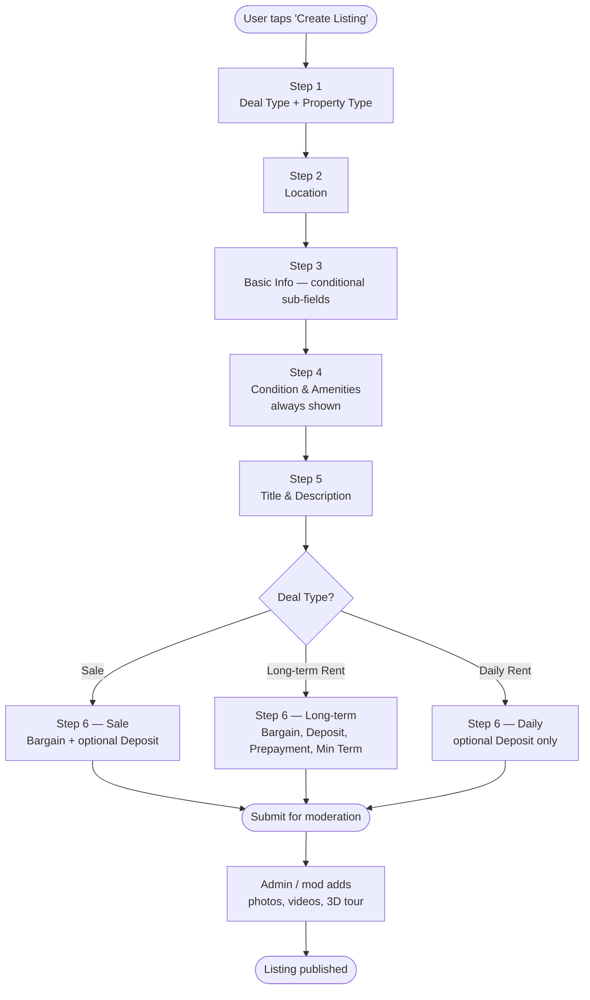
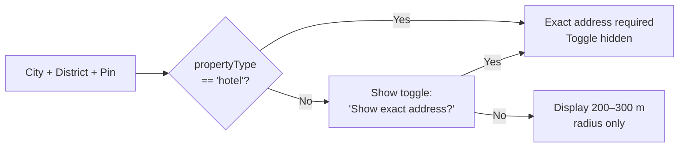
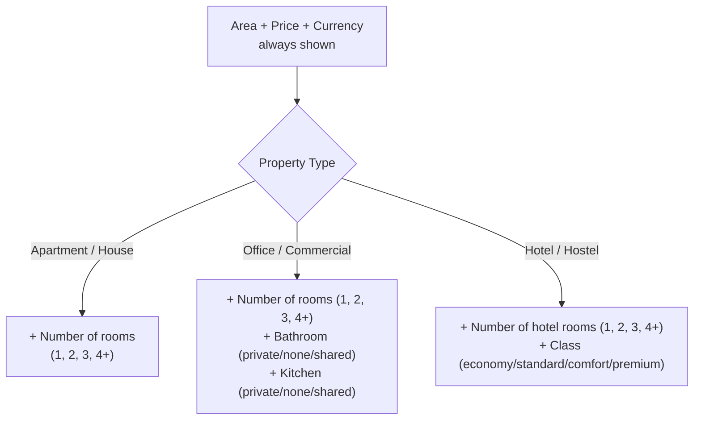

# MoveIn (JayTap) — Listing Creation Flow Specification

**Version 2** — incorporates all decisions from the open-questions round.

## Purpose

This document specifies the conditional UI flow for the **Create Listing** screens. The core principle: **never show irrelevant input fields**. Every screen and every field is determined by previous answers.

The flow has **6 steps**. The user supplies metadata only — **photos, videos, and 3D tours are uploaded after submission by an admin or mod** and are not part of the user-facing flow at all.

Launch languages: **Russian + English**.

---

## High-Level Flow



---

## Step 1 — Deal Type & Property Type

Two single-select questions on the same screen.

### 1A. Deal Type *(required)*

| Label (EN)     | Label (RU)            | Internal value |
| -------------- | --------------------- | -------------- |
| Sale           | Продажа               | `sale`         |
| Long-term rent | Долгосрочная аренда   | `rent_long`    |
| Daily rent     | Посуточная аренда     | `rent_daily`   |

**Drives:** which fields appear in Step 6.

### 1B. Property Type *(required)*

| Label (EN)       | Label (RU)              | Internal value |
| ---------------- | ----------------------- | -------------- |
| Apartment        | Квартира                | `apartment`    |
| House            | Дом                     | `house`        |
| Office           | Офис                    | `office`       |
| Commercial space | Коммерческое помещение  | `commercial`   |
| Hotel / hostel   | Отель / хостел          | `hotel`        |

**All combinations of deal type × property type are allowed.**

**Drives:**
- Sub-fields in Step 3
- Whether the exact-address toggle is shown in Step 2

---

## Step 2 — Location

Always shown. Required:

- **City** (`city`) — autocomplete or dropdown
- **District** (`district`) — dependent on city
- **Map pin** (`coordinates: { lat, lng }`) — user drops a point

### Address visibility — conditional



- **If `propertyType === 'hotel'`** → exact address is **mandatory**, toggle is **not rendered**.
- **Otherwise** → show toggle *"Show exact address?"* (Yes / No).
  - Yes → store and display exact address.
  - No → display only an approximate radius (200–300 m).

---

## Step 3 — Basic Information

### Always shown

| Field    | Key         | Type / Options                                       |
| -------- | ----------- | ---------------------------------------------------- |
| Area     | `areaSqm`   | number, m²                                           |
| Price    | `price`     | number                                               |
| Currency | `currency`  | `KGS` (сом) \| `USD` (доллар) \| `EUR` (евро)        |

### Conditional sub-fields *(by property type)*



#### Apartment **or** House

| Field           | Key     | Options             |
| --------------- | ------- | ------------------- |
| Number of rooms | `rooms` | `1`, `2`, `3`, `4+` |

#### Office **or** Commercial space

| Field           | Key        | Options                       |
| --------------- | ---------- | ----------------------------- |
| Number of rooms | `rooms`    | `1`, `2`, `3`, `4+`           |
| Bathroom        | `bathroom` | `private`, `none`, `shared`   |
| Kitchen         | `kitchen`  | `private`, `none`, `shared`   |

#### Hotel / Hostel

| Field                 | Key          | Options                                     |
| --------------------- | ------------ | ------------------------------------------- |
| Number of hotel rooms | `hotelRooms` | `1`, `2`, `3`, `4+`                         |
| Class                 | `hotelClass` | `economy`, `standard`, `comfort`, `premium` |

---

## Step 4 — Condition & Amenities

**Always shown, for every property type** (including hotels — supports rural / ethno-stay listings where condition still matters).

| Field     | Key         | Options                                                                       |
| --------- | ----------- | ----------------------------------------------------------------------------- |
| Condition | `condition` | `rough` (ПСО), `whitebox` (White box), `good` (Хорошее), `euro` (Евроремонт)  |
| Furnished | `furnished` | boolean (`true` / `false`)                                                    |

---

## Step 5 — Title & Description

Always shown. **Photos, videos, and 3D tours are not part of this step** — they are uploaded by an admin or mod after submission.

| Field         | Key          | Required? | Notes      |
| ------------- | ------------ | --------- | ---------- |
| Listing title | `title`      | Yes       | Short text |
| Description   | `description` | Yes      | Long text  |

---

## Step 6 — Deal Conditions

Fields are gated by **Deal Type** from Step 1. **Deposit is optional on every deal type**, and an admin-level setting can hide it platform-wide (see [Admin-Level Configuration](#admin-level-configuration)).

| Field                                     | Key                | Sale     | Long-term rent          | Daily rent |
| ----------------------------------------- | ------------------ | :------: | :---------------------: | :--------: |
| Bargain (negotiable)                      | `negotiable`       | ✅       | ✅                      | ❌         |
| Deposit (optional, amount + currency)     | `deposit`          | optional | optional                | optional   |
| Prepayment (preset OR custom months)      | `prepaymentMonths` | ❌       | ✅                      | ❌         |
| Minimum rental term                       | `minTerm`          | ❌       | `1_month` / `3_months`  | implicit `1_day` |

### Prepayment input *(long-term rent only)*

User picks one of:
- `0` — no prepayment
- `1` month
- `2` months
- **Custom** — free-form number of months

Stored as a single integer representing months. `0` means none. The UI renders the three presets as quick-select chips with a "Custom" option that reveals a number input.

### UX note — daily rent Step 6 is thin

After applying the rules above, daily rent's Step 6 contains only the optional deposit field. Consider one of:
- Showing it as a single-field step for consistency (recommended for clarity).
- Merging it into Step 5 to skip a near-empty screen.

I'd default to keeping it as a separate step — predictable structure beats minor screen savings.

---

## Admin-Level Configuration

Outside the listing schema. A platform-wide settings document controls cross-cutting toggles:

```js
// platformConfig
{
  depositsEnabled: boolean, // when false, deposit field is hidden across all deal types
  // future toggles go here
}
```

When `depositsEnabled === false`, the deposit field is not rendered on the user form, and any existing listing's `terms.deposit` is treated as inactive (preserved in the data, hidden from UI).

---

## Suggested Data Shape

Optimised for a flat-ish Mongo doc. Split into sub-collections later if needed.

```js
{
  dealType: 'sale' | 'rent_long' | 'rent_daily',
  propertyType: 'apartment' | 'house' | 'office' | 'commercial' | 'hotel',

  location: {
    city: string,
    district: string,
    coordinates: { lat: number, lng: number },
    showExactAddress: boolean, // forced true if propertyType === 'hotel'
  },

  basics: {
    areaSqm: number,
    price: number,
    currency: 'KGS' | 'USD' | 'EUR',

    // apartment, house, office, commercial
    rooms?: '1' | '2' | '3' | '4+',

    // office, commercial only
    bathroom?: 'private' | 'none' | 'shared',
    kitchen?:  'private' | 'none' | 'shared',

    // hotel only
    hotelRooms?: '1' | '2' | '3' | '4+',
    hotelClass?: 'economy' | 'standard' | 'comfort' | 'premium',
  },

  conditionAndAmenities: {
    condition: 'rough' | 'whitebox' | 'good' | 'euro',
    furnished: boolean,
  },

  content: {
    title: string,
    description: string,
    language: 'ru' | 'en', // language the title/description was authored in
  },

  terms: {
    negotiable?: boolean,                                                     // sale, rent_long
    deposit?: { amount: number, currency: 'KGS' | 'USD' | 'EUR' },            // optional on all types; suppressed if admin toggle off
    prepaymentMonths?: number,                                                // rent_long only; 0 = none, supports custom
    minTerm?: '1_day' | '1_month' | '3_months',                               // rent_long, rent_daily
  },

  // populated by admin / mod after submission, not by the user
  media: {
    photos:  string[],   // URLs
    videos:  string[],   // URLs
    tourUrl?: string,    // 3D tour URL
  },

  // workflow
  status: 'draft' | 'pending_moderation' | 'published' | 'rejected',

  createdBy: ObjectId,
  createdAt: Date,
  updatedAt: Date,
  publishedAt?: Date,
}
```

---

## Validation Rules (per step)

| Step | Rule                                                                                                                                        |
| ---- | ------------------------------------------------------------------------------------------------------------------------------------------- |
| 1    | Both `dealType` and `propertyType` required to advance.                                                                                     |
| 2    | `city`, `district`, `coordinates` required. `showExactAddress` ignored for hotels (forced true).                                            |
| 3    | `areaSqm > 0`, `price > 0`, `currency ∈ {KGS, USD, EUR}`. Conditional fields required per property type.                                    |
| 4    | `condition` and `furnished` both required for every property type.                                                                          |
| 5    | `title` and `description` non-empty.                                                                                                        |
| 6    | Required fields per deal type as per matrix. If admin `depositsEnabled === false`, the deposit field is not rendered and not validated.     |

---

## Localisation

Launch languages: **Russian + English**.

- All UI labels, options, and validation messages must have RU + EN translations.
- Internal values (the `Internal value` columns above) are canonical keys — display strings are looked up at render time per the user's language preference.
- City / district names: stored as a localised structure, e.g. `{ ru: 'Бишкек', en: 'Bishkek' }`.
- User-entered free text (title, description) is stored in whichever language they wrote it; capture it in `content.language` for filtering and search.

---

## Glossary (RU → EN)

| Russian                              | English                          |
| ------------------------------------ | -------------------------------- |
| ШАГ                                  | Step                             |
| Тип сделки                           | Deal type                        |
| Тип недвижимости                     | Property type                    |
| Продажа                              | Sale                             |
| Долгосрочная аренда                  | Long-term rent                   |
| Посуточная аренда                    | Daily rent                       |
| Квартира / Дом / Офис                | Apartment / House / Office       |
| Коммерческое помещение               | Commercial space                 |
| Отель / хостел                       | Hotel / hostel                   |
| Местоположение                       | Location                         |
| Город / Район                        | City / District                  |
| Поставить точку на карте             | Drop pin on map                  |
| Показать точный адрес?               | Show exact address?              |
| Площадь                              | Area                             |
| Цена / Валюта                        | Price / Currency                 |
| сом / доллар / евро                  | som (KGS) / dollar (USD) / euro (EUR) |
| Количество комнат                    | Number of rooms                  |
| Количество кабинетов / помещений     | Number of offices / rooms        |
| Санузел                              | Bathroom                         |
| Кухня                                | Kitchen                          |
| есть / нет / общий (общая)           | private / none / shared          |
| Количество номеров                   | Number of hotel rooms            |
| Класс                                | Class                            |
| эконом / стандарт / комфорт / премиум | economy / standard / comfort / premium |
| Состояние                            | Condition                        |
| ПСО (черновая)                       | Rough (PSO)                      |
| White box (почти готово)             | White box                        |
| Хорошее                              | Good                             |
| Евроремонт                           | Euro renovation                  |
| Мебель                               | Furniture                        |
| Заголовок объявления                 | Listing title                    |
| Описание                             | Description                      |
| Условия сделки                       | Deal conditions                  |
| Торг                                 | Bargain / negotiable             |
| Депозит                              | Deposit                          |
| Предоплата                           | Prepayment                       |
| Минимальный срок аренды              | Minimum rental term              |
| 1 день / 1 месяц / 3 месяца          | 1 day / 1 month / 3 months       |

---

## Decisions Log

| #  | Question                                          | Decision                                                           |
| -- | ------------------------------------------------- | ------------------------------------------------------------------ |
| 1  | Deal-type × property-type compatibility           | All combinations allowed                                           |
| 2  | Bargain on daily rentals                          | Excluded                                                           |
| 3  | Deposits                                          | Optional on all deal types; platform-wide admin toggle to hide     |
| 4  | Hotels in Step 4                                  | Included — supports rural / ethno properties                       |
| 5  | Prepayment custom values                          | Supported. Stored as integer months (`0` = none)                   |
| 6  | Photos                                            | Removed from user flow — admin / mod uploads post-submission       |
| 7  | 3D tour                                           | Removed from user flow — admin / mod uploads post-submission       |
| 8  | Currencies                                        | KGS, USD, EUR                                                      |
| 9  | Localisation                                      | RU + EN at launch                                                  |
